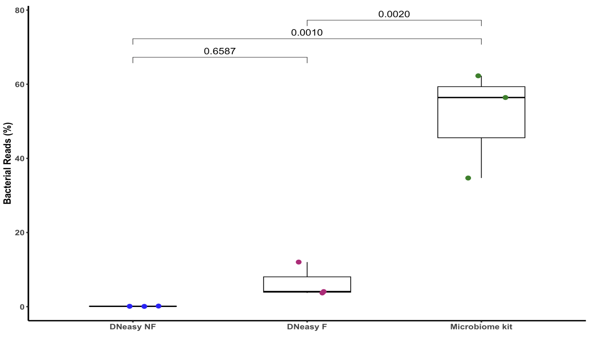
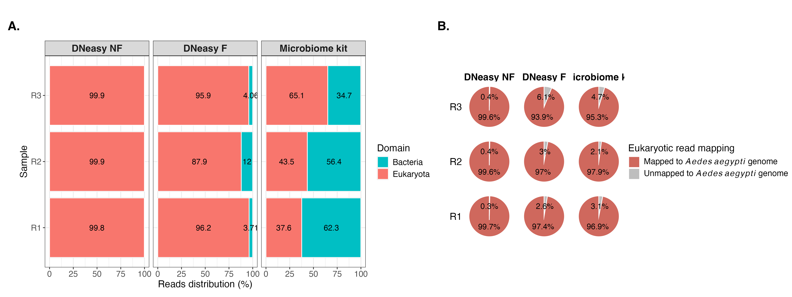
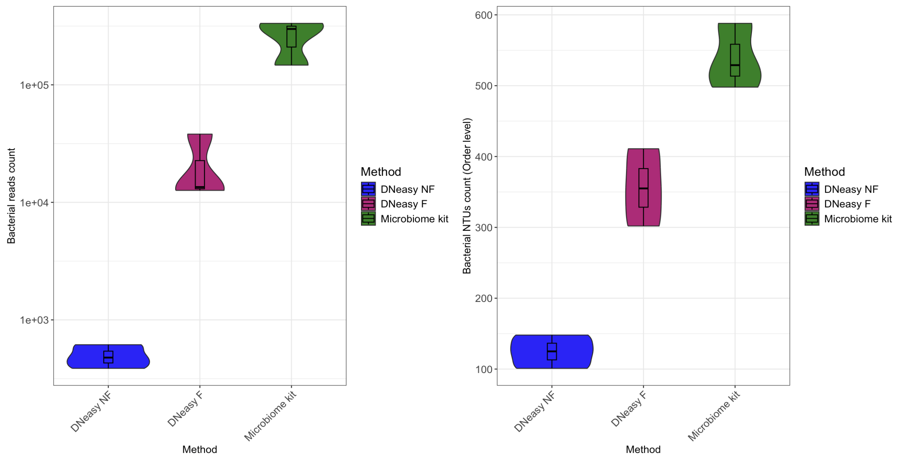
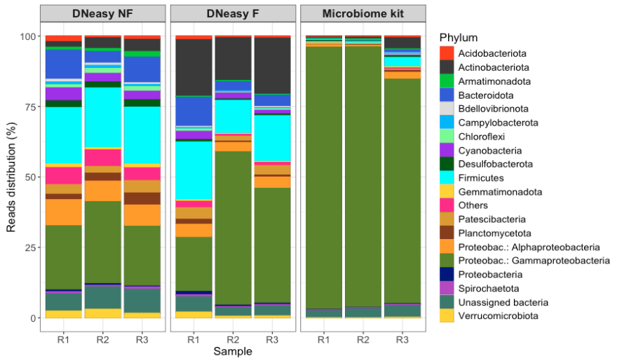
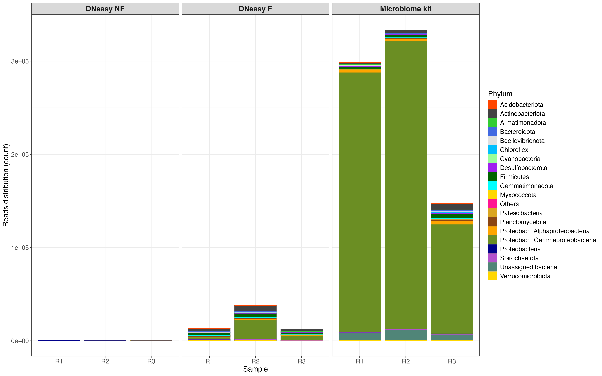
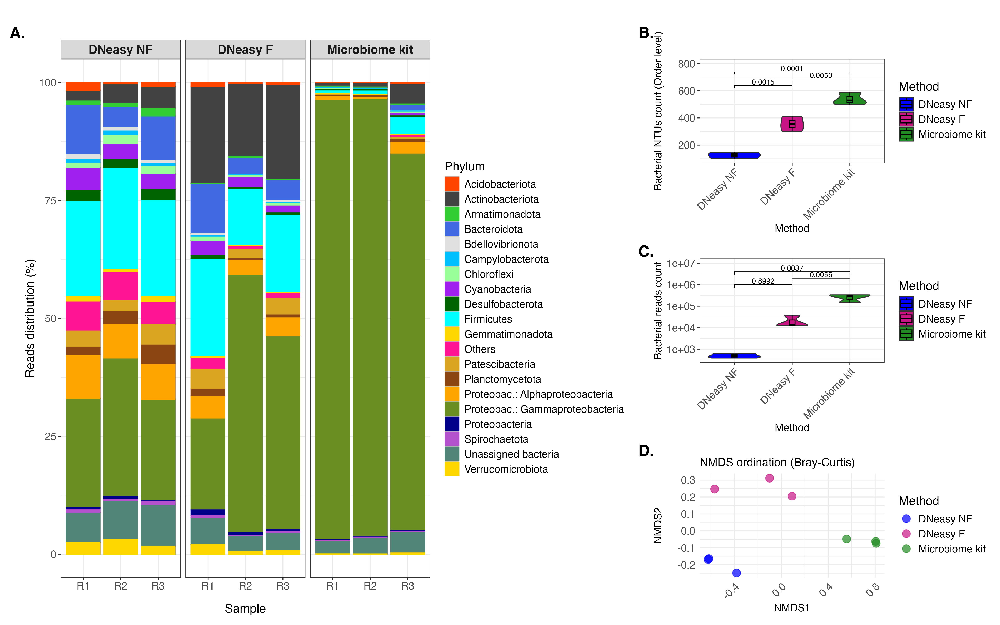

This project describes the bioinformatic reproductible workflow related to the paper "Filtration- and lysis-based bacterial enrichment procedures differentially improve mosquito midgut microbiota analyses".

# Download metagenomes

Raw sequences can be accessed in the Europe Nucleotide Archive database (ENA): Study accession number **PRJEB96753**. 

We analyzed 9 samples of pooled midguts from *Aedes aegypti* females (Paea strain) reported here:

|Sequencing name| Sample name       | Species          | Organ              | R1                                            | R2                                            | Study accession number (ENA) | Read accession number (ENA) |
|:-------------:|:-----------------:|:----------------:|:------------------:|:---------------------------------------------:|:---------------------------------------------:|:----------------------------:|:---------------------------:|
| Aeae_mg_1_1_5 | DNeasy NF-R1      | *Aedes aegypti*  | MIDGUT (pool of 5) | 1-1_5_midgut_Aedes_aegypti_S1_R1_001.fastq.gz | 1-1_5_midgut_Aedes_aegypti_S1_R2_001.fastq.gz | PRJEB96753                   | ERR15500130                 |
| Aeae_mg_1_2_5 | DNeasy NF-R2      | *Aedes aegypti*  | MIDGUT (pool of 5) | 1-2_5_midgut_Aedes_aegypti_S2_R1_001.fastq.gz | 1-2_5_midgut_Aedes_aegypti_S2_R2_001.fastq.gz | PRJEB96753                   | ERR15500131                 |
| Aeae_mg_1_3_5 | DNeasy NF-R3      | *Aedes aegypti*  | MIDGUT (pool of 5) | 1-3_5_midgut_Aedes_aegypti_S3_R1_001.fastq.gz | 1-3_5_midgut_Aedes_aegypti_S3_R2_001.fastq.gz | PRJEB96753                   | ERR15500132                 |
| Aeae_mg_2_1_5 | DNeasy F-R1       | *Aedes aegypti*  | MIDGUT (pool of 5) | 2-1_5_midgut_Aedes_aegypti_S4_R1_001.fastq.gz | 2-1_5_midgut_Aedes_aegypti_S4_R2_001.fastq.gz | PRJEB96753                   | ERR15500133                 |
| Aeae_mg_2_2_5 | DNeasy F-R2       | *Aedes aegypti*  | MIDGUT (pool of 5) | 2-2_5_midgut_Aedes_aegypti_S5_R1_001.fastq.gz | 2-2_5_midgut_Aedes_aegypti_S5_R2_001.fastq.gz | PRJEB96753                   | ERR15500134                 |
| Aeae_mg_2_3_5 | DNeasy F-R3       | *Aedes aegypti*  | MIDGUT (pool of 5) | 2-3_5_midgut_Aedes_aegypti_S6_R1_001.fastq.gz | 2-3_5_midgut_Aedes_aegypti_S6_R2_001.fastq.gz | PRJEB96753                   | ERR15500135                 |
| Aeae_mg_5_1_5 | Microbiome kit-R1 | *Aedes aegypti*  | MIDGUT (pool of 5) | 5-1_5_midgut_Aedes_aegypti_S7_R1_001.fastq.gz | 5-1_5_midgut_Aedes_aegypti_S7_R2_001.fastq.gz | PRJEB96753                   | ERR15500136                 |
| Aeae_mg_5_2_5 | Microbiome kit-R2 | *Aedes aegypti*  | MIDGUT (pool of 5) | 5-2_5_midgut_Aedes_aegypti_S8_R1_001.fastq.gz | 5-2_5_midgut_Aedes_aegypti_S8_R2_001.fastq.gz | PRJEB96753                   | ERR15500137                 |
| Aeae_mg_5_3_5 | Microbiome kit-R3 | *Aedes aegypti*  | MIDGUT (pool of 5) | 5-3_5_midgut_Aedes_aegypti_S9_R1_001.fastq.gz | 5-3_5_midgut_Aedes_aegypti_S9_R2_001.fastq.gz | PRJEB96753                   | ERR15500138                 |


# Process data

## Adaptor trimming

We removed adapters using the following adapters and code:

[adapters.fa](files/adapters.fa)

```
for r1 in *_R1_001.fastq.gz
do
# copy the filename, r1, to a new file name, r2 and substitute R1 in the name with R2
# this generates the name of the R2 file
    r1=$(echo $r1 | sed 's|.*\/||')
    r2=$r1
    r2="${r1/_R1/_R2}"
# generate the names for the output files
    r1t=$r1
    r1t="${r1t/_R1_001.fastq.gz/_R1_trimmed.fastq.gz}"
    r2t=$r1
    r2t="${r2t/_R1_001.fastq.gz/_R2_trimmed.fastq.gz}"
    NAME=$r1
    NAME="${NAME/_R1_001.fastq.gz/}"

# run bbduk
bbduk.sh  in1=$r1 in2=$r2 \
          out1=bbduk/$r1t out2=bbduk/$r2t \
          ref=adapters-reduced.fa \
          stats=bbduk/"$NAME"_stats.txt \
          ktrim=r k=19 mink=9 hdist=1 tpe tbo 

done	
```

## Quality control  

We used illumina-utils to control quality of metagenomic short reads following this command:

```
anvi-run-workflow -w metagenomics \
                  -c ../metadata/config_minoche.json \
                  --additional-params --until gzip_fastqs --rerun-incomplete

```

[samples_minoche.txt](files/samples_minoche.txt)

[config_minoche.json](files/config_minoche.json)


## Phyloflash

### Run phyloFlash

We used phyloflash based on SSU rRNA sequences to make taxonomic profile in our samples using this command:

```
for r1 in $DWK/01_DATA/*_R1_trimmed.fastq.gz
do
# copy the filename, r1, to a new file name, r2 and substitute R1 in the name with R2
# this generates the name of the R2 file
    r1=$(echo $r1 | sed 's|.*\/||')
    r2=$r1
    r2="${r1/_R1/_R2}"
    echo "R1:$r1 and R2:$r2"
    NAME=$r1
    NAME="${NAME/-QUALITY_PASSED_R1_trimmed.fastq.gz/}"
    echo "Name:$NAME"

    mkdir -p $NAME
    
    phyloFlash.pl -lib ${NAME} -read1 $DWK/01_DATA/${r1} -read2 $DWK/01_DATA/${r2} -readlength 150 -almosteverything -CPUs 12 -dbhome /db/outils/phyloflash-3.4.1/138.1
done
```

### Plots and statistics

#### Import data and create phyloseq object 

```
# Load packages
require(here)
require(phyloseq)
require(data.table)
require(patchwork)
require(reshape2)
require(ggpubr)
require(tibble)
require(dplyr)
require(tidyr)

# Extract list of samples
samples <- list.files(here("../../02_Phyloflash"))

# Initializing the full phylotype table
full_dt <- data.frame("Phylotype" = "NA")

# Reading each table and merging it with the previous ones
for (i in samples){
  NTU_table <- read.csv(paste0(here("../../02_Phyloflash/"), 
                               i, "/", 
                               i, ".phyloFlash/", 
                               i, ".phyloFlash.NTUabundance.csv"),
                               #i, ".phyloFlash.NTUfull_abundance.csv"), 
                        header = FALSE)
  # Renaming the columns
  colnames(NTU_table) <- c("Phylotype", i)
  
  # Merge the phylotype tables
  full_dt <- merge(full_dt, NTU_table, by="Phylotype", all.x=TRUE, all.y=TRUE) 
}

# Some stats about the complete dataframe
dim(full_dt)
full_dt[is.na(full_dt)] <- 0
colSums(full_dt[2:10])

# 1) Creating the "otu table" aka the abundance table (columns 2 to end of datatable)
rownames(full_dt) <- paste0("Phylotype", c(1:nrow(full_dt)))
PHYLO <- full_dt[, c(2:ncol(full_dt))]
PHYLO <- otu_table(PHYLO, taxa_are_rows = TRUE)

# 2) Creating the taxonomy table 
# keep in mind this table only goes to order level with the taxonomy, but I could have gone to species (NTUfull_abundance.csv)
TAXO <- colsplit(full_dt$Phylotype, ";", c("Domain", "Phylum", "Class", "Order"))
TAXO <- as.matrix(TAXO)
rownames(TAXO) <- rownames(full_dt)
TAXO <- tax_table(TAXO)

# 3) Creating the metadata table
metadata <- data.frame(matrix(nrow = length(samples)))
rownames(metadata) <- samples

# Reformat some info
metadata$Host <- "Aedes aegypti"
metadata$Organ <- "5 midgut pool" 
metadata[grep('_mg_1_', rownames(metadata)), "Method"] <- "DNeasy NF"
metadata[grep('_mg_2_', rownames(metadata)), "Method"] <- "DNeasy F"
metadata[grep('_mg_5_', rownames(metadata)), "Method"] <- "Microbiome kit"
metadata[grep('_1_5$', rownames(metadata)), "Replicate"] <- "R1"
metadata[grep('_2_5$', rownames(metadata)), "Replicate"] <- "R2"
metadata[grep('_3_5$', rownames(metadata)), "Replicate"] <- "R3"

# Remove the first weird column
metadata <- metadata[, c(2:ncol(metadata))]

# Load mapping data
mapping_stats <- read.table(here("../../mapping_stats_corr.tsv"), 
                            header = TRUE, sep = "\t", stringsAsFactors = FALSE)

# Rename columns to avoid conflicts
colnames(mapping_stats) <- c("sample", "Total_Reads", "Mapped_Reads", "Mapped_Percentage")

# Check the data
head(mapping_stats)

# Add mapping percent in metadata table
metadata <- metadata %>% 
  rownames_to_column("sample") %>% 
  left_join(mapping_stats, by = "sample") %>% 
  column_to_rownames("sample")

# Convert to phyloseq object
META <- sample_data(metadata)

# 4) Creating the phyloseq object
ps_phylo <- phyloseq(PHYLO, TAXO, META)
rm(PHYLO, TAXO, META)

# Making the phyloseq object relative abundance
ps_phylo_rel <- transform_sample_counts(ps_phylo, function(x) x / sum(x) * 100)
```

#### PhyloFlash relative abundance and count plots

```
# Remove Archaea and NAs
ps_phylo_rel_domain <- subset_taxa(ps_phylo_rel, Domain != "Archaea")

# Aggregate by domain
ps_phylo_rel_domain <- tax_glom(ps_phylo_rel_domain, taxrank = rank_names(ps_phylo_rel_domain)[1], NArm = FALSE)

# Set order levels of Method and Domain
ps_phylo_rel_domain@sam_data$Method <- factor(ps_phylo_rel_domain@sam_data$Method, 
                                              levels = c("DNeasy NF", "DNeasy F", "Microbiome kit"))

# Set colors for Eukaryota and Bacteria domains
domain_color = c("Eukaryota" = "#F8766D", "Bacteria" = "#00BFC4")

# Percent plot 
p1 <- plot_bar(ps_phylo_rel_domain, x = "Replicate", fill = "Domain", facet_grid = ~Method) + 
  geom_col(position = "stack", color="white") +
  labs(x = "Sample", y = "Reads distribution (%)", fill="Domain") +
  scale_fill_manual(values = domain_color) +
  geom_text(aes(label = ifelse(signif(Abundance, digits = 3) > 1, signif(Abundance, digits = 3), "")),
            position = position_stack(vjust = 0.5),
            color="black", size=4) +
  theme_bw() +
  theme(axis.text = element_text(size = 12, angle = 0), 
        axis.title = element_text(size = 14), 
        strip.text = element_text(face = "bold", size = 14)) +
  coord_flip()

# Display relative abundance plot
p1
```


```
# Remove Archaea and NAs
ps_phylo_domain <- subset_taxa(ps_phylo, Domain != "Archaea")

# Aggregate by domain
ps_phylo_domain <- tax_glom(ps_phylo_domain, taxrank = rank_names(ps_phylo_domain)[1], NArm = FALSE)

# Set order levels of Method and Domain
ps_phylo_domain@sam_data$Method <- factor(ps_phylo_domain@sam_data$Method, 
                                              levels = c("DNeasy NF", "DNeasy F", "Microbiome kit"))

# Set colors for Eukaryota and Bacteria domains
domain_color = c("Eukaryota" = "#F8766D", "Bacteria" = "#00BFC4")

# Count plot
p1b <- plot_bar(ps_phylo_domain, x = "Replicate", fill = "Domain", facet_grid = ~Method) + 
  geom_col(position = "stack", color="white") +
  labs(x = "Sample", y = "Reads distribution", fill="Domain") +
  scale_fill_manual(values = domain_color) +
  #geom_text(aes(label = ifelse(signif(Abundance, digits = 3) > 1, signif(Abundance, digits = 3), "")),
  geom_text(aes(label = ifelse(Abundance > 1, format(Abundance, scientific = FALSE), "")),
            position = position_stack(vjust = 0.5),
            color="black", size=4) +
  theme_bw() +
  theme(axis.text = element_text(size = 12),
        axis.text.x = element_text(size = 12, angle = 45, hjust = 0.5, vjust = 0.6),
        axis.title = element_text(size = 14), 
        strip.text = element_text(face = "bold", size = 14),
        legend.title      = element_text(size = 14),
        legend.text       = element_text(size = 12),
        legend.key.size   = unit(1.2, "lines")) +
  coord_flip()

# Display count plot
p1b
```


#### Pie charts 

We generate pie charts of mapped and unmapped eukaryotic SSU rRNA reads to Aedes aegypti reference genome following these commands: 

```
# Create dataframe for pie charts
pie_data <- metadata %>%
  rownames_to_column("sample") %>%
  select(sample, Method, Replicate, Mapped_Percentage) %>%
  mutate(Unmapped_Percentage = 100 - Mapped_Percentage) %>%
  pivot_longer(cols = c(Mapped_Percentage, Unmapped_Percentage),
               names_to = "Category", values_to = "Percentage") %>%
  mutate(Category = factor(Category, levels = c("Mapped_Percentage", "Unmapped_Percentage")))

# Set colors
pie_colors <- c("Mapped_Percentage" = "#CF685D", "Unmapped_Percentage" = "grey")

# Invert replicates order
pie_data <- pie_data %>%
  mutate(Replicate = factor(Replicate, levels = c("R3", "R2", "R1")))  # Inversion de l'ordre des réplicats

# Change methods order
pie_data <- pie_data %>%
  mutate(Method = factor(Method, levels = c("DNEasy NF", "DNEasy F", "Microbiome kit")))

# Generate pie charts
p2 <- ggplot(pie_data, aes(x = "", y = Percentage, fill = Category)) +
  geom_col(width = 1, color = "white") +
  coord_polar("y", start = 0) +
  facet_grid(Replicate ~ Method) +  # Alignement selon la méthode et le replicat
  scale_fill_manual(values = pie_colors,  
                    labels = c("Mapped to Aedes aegypti genome", 
                               "Unmapped to Aedes aegypti genome")) +
  labs(fill = "Eukaryotic read mapping")  +
  theme_void() +
  theme(legend.position = "right",
        strip.text = element_text(face = "bold", size = 14),
        legend.spacing.x = unit(1, 'cm'),
        legend.title      = element_text(size = 14),
        legend.text       = element_text(size = 12),
        legend.key.size   = unit(1.2, "lines")) +
  geom_text(aes(label = paste0(round(Percentage, 1), "%")), 
            position = position_stack(vjust = 0.5), size = 4, color = "black")

# Align them using facet_grid
p2 <- p2 + facet_grid(rows = vars(Replicate), cols = vars(Method), switch = "y") + 
  theme(
    strip.placement = "outside",
    strip.text.y = element_text(angle = 0, hjust = 1, face = "plain"),
    axis.title.y = element_blank()
  )
    
# Display pie charts 
p2
```


#### Boxplot and statistics

```
# Data from plot 1
df_p1 <- p1$data

# Keep only Eukaryota
df_bac <- df_p1 %>%
  filter(Domain == "Bacteria")

# Set Method as factor
df_bac$Method <- as.factor(df_bac$Method)

# Boxplot of mean bacterialreads from each sample
p_box <- ggplot(df_bac, aes(x = Method, y = Abundance)) +
  geom_boxplot(outlier.shape = NA, width = 0.5, color = "black") +
  geom_jitter(aes(color = Method), width = 0.15, size = 3) +
  labs(x = "", y = "Bacterial Reads (%)") +
  scale_color_manual(values = c("DNeasy NF" = "blue", "DNeasy F" = "#C71585", "Microbiome kit" = "#228B22")) +
  theme_classic() +  
  theme(legend.position = "none",  
        axis.text.x = element_text(face = "bold", size = 12), 
        axis.text.y = element_text(face = "bold", size = 12),
        axis.title.y = element_text(size = 14, face = "bold"),  
        axis.line = element_line(linewidth = 1),  
        axis.ticks = element_line(linewidth = 1),
        legend.title      = element_text(size = 14),
        legend.text       = element_text(size = 12),
        legend.key.size   = unit(1.2, "lines"))

# Display boxplot
p_box

# Compute ANOVA by Method
anova_result <- aov(Abundance ~ Method, data = df_bac)

# Tukey's post-hoc test
tukey_result <- TukeyHSD(anova_result)

# Convert to dataframe for ggplot
df_tukey <- as.data.frame(tukey_result$Method)
df_tukey <- tibble::rownames_to_column(df_tukey, "Comparison")

# Extract p-values from Tukey comparisons
df_tukey <- df_tukey %>%
  select(Comparison, `p adj`) %>%
  rename(p_value = `p adj`) %>%
  mutate(p_signif = case_when(
    p_value < 0.001 ~ "***",
    p_value < 0.01 ~ "**",
    p_value < 0.05 ~ "*",
    TRUE ~ "ns"  # Pas significatif
  ))

# Reformat names from tukey results
df_tukey <- df_tukey %>%
  mutate(group1 = gsub("-.*", "", Comparison),  # extract 1st name of comparison
         group2 = gsub(".*-", "", Comparison))  # extract 2nd one

# Check and reorder comparisons
df_tukey <- df_tukey %>%
  rowwise() %>%
  mutate(group1_fixed = min(group1, group2), 
         group2_fixed = max(group1, group2)) %>%
  ungroup() %>%
  select(-group1, -group2) %>%
  rename(group1 = group1_fixed, group2 = group2_fixed)

# Check comparisons after correction
print(df_tukey)

# Change levels of Tukey's group
df_tukey$group1 <- factor(df_tukey$group1, levels = levels(df_bac$Method))
df_tukey$group2 <- factor(df_tukey$group2, levels = levels(df_bac$Method))

# Set p-value decimals
df_tukey$p_value <- formatC(df_tukey$p_value, format = "f", digits = 4)

# Boxplot with Tukey's p-values             
p_box <- p_box + 
  stat_pvalue_manual(df_tukey, 
                     label = "p_value", 
                     xmin = "group1", 
                     xmax = "group2",
                     y.position = c(max(df_bac$Abundance) + 5, max(df_bac$Abundance) + 10, max(df_bac$Abundance) + 15),
                     tip.length = 0.02, size = 5, inherit.aes=FALSE)

# Display boxplot including p-values
p_box
```



#### Merge plots

```
require(patchwork)

tag_labels <- c("A", "B")
                
# Combine plots and legends
combined_plot <- (p1b + p_box) +
  plot_layout(ncol = 2, widths = c(2, 1)) +  # Largeur ajustée
  #plot_layout(heights = c(1, 1)) +
  plot_annotation(title = "", tag_levels = list(tag_labels), tag_suffix = ".") & 
  theme(
    legend.position = "right",
    legend.justification = "center",
    legend.box = "vertical",
    legend.spacing.y = unit(0.5, "cm"),
    plot.tag = element_text(size = 18, face = "bold")
  )

# Display combined plot
combined_plot
```


```
require(patchwork)

tag_labels <- c("A", "B")
                
# Combine plots and legends
  combined_plot2 <- (p1 + p2) +
  plot_layout(ncol = 2, widths = c(2, 1)) +  # Largeur ajustée
  #plot_layout(heights = c(1, 1)) +
  plot_annotation(title = "", tag_levels = list(tag_labels), tag_suffix = ".") & 
  theme(
    legend.position = "right",
    legend.justification = "center",
    legend.box = "vertical",
    legend.spacing.y = unit(0.5, "cm"),
    plot.tag = element_text(size = 18, face = "bold")
  )

# Display combined plot
combined_plot2
```




#### Bacterial reads and NTUs plots

```
# Select only Bacteria
ps_phylo_prok <- subset_taxa(ps_phylo, Domain == "Bacteria")

# Extract count of bacteria reads
phylo_nb <- ps_phylo_prok@sam_data

# Adding the number of reads by sample to the dataframe
phylo_nb$Total_reads <- sample_sums(ps_phylo_prok)

# Adding the number of NTUs by sample to the dataframe
phylo_nb$Nb_phylo <- apply(ps_phylo_prok@otu_table > 0, 2, sum)

# Set Method levels order
phylo_nb$Method <- factor(phylo_nb$Method,
                                  levels = c("DNeasy NF", "DNeasy F", "Microbiome kit"))

# Set colors for Methods
my_colors <- c(
  "DNeasy NF"      = "blue",
  "DNeasy F"       = "#C71585",
  "Microbiome kit" = "#228B22"
)

# Plot of number of reads by method
nb_reads <- ggplot(phylo_nb, aes(x = Method, y = Total_reads, fill = Method)) +
  geom_violin() + geom_boxplot(width=0.1,color="black") +
  scale_fill_manual(values = my_colors) +
  theme_bw() +
  theme(axis.text = element_text(size = 12, angle = 0),
        axis.text.x=element_text(size = 12, angle = 45, hjust = 1),
        axis.text.y = element_text(face="plain",size=12),
        axis.title = element_text(size = 12), 
        strip.text = element_text(face = "bold", size = 14), 
        legend.text = element_text(size = 12), 
        legend.title = element_text(size = 14))+
  ylab("Bacterial reads count") + scale_y_log10()
      
# Plot of number of NTUs by method
nb_phylo <- ggplot(phylo_nb, aes(x = Method, y = Nb_phylo, fill = Method)) +
  geom_violin() + geom_boxplot(width=0.1,color="black") +
  scale_fill_manual(values = my_colors) +
  theme_bw() +
  theme(axis.text = element_text(size = 12, angle = 0),
        axis.text.x=element_text(size = 12, angle = 45, hjust = 1),
        axis.text.y = element_text(face="plain",size=12),
        axis.title = element_text(size = 12), 
        strip.text = element_text(face = "bold", size = 14), 
        legend.text = element_text(size = 12), 
        legend.title = element_text(size = 14))+
  ylab("Bacterial NTUs count (Order level)") 

# Display plots
nb_reads + nb_phylo
```



#### Statistics 

Statistics on number of bacterial reads. 

```
# ANOVA for number of reads
phylo_nb_df <- as.data.frame(as.matrix(phylo_nb))
anova_reads <- aov(Total_reads ~ Method, data = phylo_nb_df)
summary(anova_reads)

# Tukey's test
tukey_reads <- TukeyHSD(anova_reads)

# Convert to dataframe for ggplot
df_tukey <- as.data.frame(tukey_reads$Method)
df_tukey <- tibble::rownames_to_column(df_tukey, "Comparison")


# Extract p-values from Tukey's comparisons
df_tukey <- df_tukey %>%
  select(Comparison, `p adj`) %>%
  rename(p_value = `p adj`) %>%
  mutate(p_signif = case_when(
    p_value < 0.001 ~ "***",
    p_value < 0.01 ~ "**",
    p_value < 0.05 ~ "*",
    TRUE ~ "ns"  # Pas significatif
  ))

# Adapt names
df_tukey <- df_tukey %>%
  mutate(group1 = gsub("-.*", "", Comparison),  # extract 1st name of comparison
         group2 = gsub(".*-", "", Comparison))  # extraire 2nd name

# Check and reorder comparisons
df_tukey <- df_tukey %>%
  rowwise() %>%
  mutate(group1_fixed = min(group1, group2), 
         group2_fixed = max(group1, group2)) %>%
  ungroup() %>%
  select(-group1, -group2) %>%
  rename(group1 = group1_fixed, group2 = group2_fixed)

# Check comparisons after correction
print(df_tukey)

# Change levels order of Tukey's groups
df_tukey$group1 <- factor(df_tukey$group1, levels = levels(phylo_nb$Method))
df_tukey$group2 <- factor(df_tukey$group2, levels = levels(phylo_nb$Method))

# Set p-values decimals
df_tukey$p_value <- formatC(df_tukey$p_value, format = "f", digits = 4)

# Plot with p-values from Tukey's test
nb_reads <- nb_reads + stat_pvalue_manual(df_tukey, 
                     label = "p_value", 
                     xmin = "group1", 
                     xmax = "group2",
                     y.position = c(6, 6.3, 6.6),
                     tip.length = 0.02, size = 3, inherit.aes=FALSE)

# Change y limit
nb_reads <- nb_reads + expand_limits(y = 10^7)
```

Statistics on number of NTUs. 

```
# ANOVA for NTUs number
anova_phylo <- aov(Nb_phylo ~ Method, data = phylo_nb_df)
summary(anova_phylo)

# Tukey's test
tukey_phylo <- TukeyHSD(anova_phylo)

# Convert to dataframe for ggplot
df_tukey <- as.data.frame(tukey_phylo$Method)
df_tukey <- tibble::rownames_to_column(df_tukey, "Comparison")


# Extract p-values for Tukey's comparisons
df_tukey <- df_tukey %>%
  select(Comparison, `p adj`) %>%
  rename(p_value = `p adj`) %>%
  mutate(p_signif = case_when(
    p_value < 0.001 ~ "***",
    p_value < 0.01 ~ "**",
    p_value < 0.05 ~ "*",
    TRUE ~ "ns"  # Pas significatif
  ))

# Adapt names
df_tukey <- df_tukey %>%
  mutate(group1 = gsub("-.*", "", Comparison),  # extract 1st name of comparison
         group2 = gsub(".*-", "", Comparison))  # extract 2nd name

# Check and reorder comparisons
df_tukey <- df_tukey %>%
  rowwise() %>%
  mutate(group1_fixed = min(group1, group2), 
         group2_fixed = max(group1, group2)) %>%
  ungroup() %>%
  select(-group1, -group2) %>%
  rename(group1 = group1_fixed, group2 = group2_fixed)

# Check comparisons after correction
print(df_tukey)

# Change levels order of Tukey's groups
df_tukey$group1 <- factor(df_tukey$group1, levels = levels(phylo_nb$Method))
df_tukey$group2 <- factor(df_tukey$group2, levels = levels(phylo_nb$Method))

# Set p-values decimals
df_tukey$p_value <- formatC(df_tukey$p_value, format = "f", digits = 4)

# NTUs plot with Tukey's p-values
nb_phylo <- nb_phylo + stat_pvalue_manual(df_tukey, 
                     label = "p_value", 
                     xmin = "group1", 
                     xmax = "group2",
                     y.position = c(max(phylo_nb$Nb_phylo) + 50, max(phylo_nb$Nb_phylo) + 100, max(phylo_nb$Nb_phylo) + 150),
                     tip.length = 0.02, size = 3, inherit.aes=FALSE)

# Change y limit
nb_phylo <- nb_phylo + expand_limits(y = 800)
```

#### Plots with statistics

```
require(patchwork)

# Combine plots with legends
combined_plot <- (nb_reads + nb_phylo) + 
  plot_layout(ncol = 2, widths = c(1, 1)) +  # Largeur ajustée
  plot_annotation(title = "", tag_levels = "A", tag_suffix = ".") & 
  theme(
    legend.position = "right",
    legend.justification = "center",
    legend.box = "vertical",
    legend.spacing.y = unit(0.5, "cm"),
    plot.tag = element_text(size = 18, face = "bold")
  )

# Display combined plot
combined_plot
```


#### Prokaryotic taxonomy

```
# Set colors for taxa
scale_taxon = c("#FF4500", "grey26", "#32CD32", "#4169e1", "#e0e0e0", "#00bfff", 
                "#99ff99", "#a020f0", "#006400", "#00FFFF", "#FFD700", "#FF1493", 
                "#DAA520", "#8B4513", "#FFA500", "#6B8E23", "darkblue", 
                "mediumorchid3", "#508578", "gold")


# We will do relative abundance, but please be aware that we are dealing with very widely different number of phylotypes here
ps_phylo_prok_rel <- transform_sample_counts(ps_phylo_prok, function(x) x / sum(x) * 100)

taxo <- data.frame(ps_phylo_prok_rel@tax_table)
taxo$Phylum_keep <- taxo$Phylum
taxo <- as.data.table(taxo)

# Set more resolution in Proteobacteria and Crenarchaeota for clarity
taxo[Class=="Alphaproteobacteria", Phylum:="Proteobac.: Alphaproteobacteria"]
taxo[Class=="Gammaproteobacteria", Phylum:="Proteobac.: Gammaproteobacteria"]
taxo[Class=="Zetaproteobacteria", Phylum:="Proteobac.: Zetaproteobacteria"]
taxo[Class=="Magnetococcia", Phylum:="Proteobac.: Magnetococcia"]
taxo[Phylum=="Proteobacteria" & is.na(Class), Phylum:="Unassigned Proteobacteria"]
taxo[Class=="Bathyarchaeia", Phylum:="Crenarchaeota: Bathyarchaeia"]
taxo[Class=="Nitrososphaeria", Phylum:="Crenarchaeota: Nitrososphaeria"]
taxo[Phylum=="Crenarchaeota", Phylum:="Crenarchaeota (NA)"]
taxo[Phylum=="(Bacteria)", Phylum:="Unassigned bacteria"]
taxo[Phylum=="(Archaea)", Phylum:="Unassigned archaea"]

taxo <- as.matrix(taxo)
rownames(taxo) <- taxa_names(ps_phylo_prok_rel)

ps_phylo_prok_rel <- phyloseq(otu_table(ps_phylo_prok_rel), tax_table(taxo), sample_data(ps_phylo_prok_rel))

general_taxo_phy <- tax_glom(ps_phylo_prok_rel, taxrank=rank_names(ps_phylo_prok_rel)[2], NArm=FALSE)

df_phy <- data.frame(general_taxo_phy@tax_table[,c(1:2)])
df_phy$percent <- signif((taxa_sums(general_taxo_phy) * 100 / 9), 3)
df_phy <- df_phy[order(-df_phy$percent),]

# Leep 17 most abundant
phylum_to_keep <- df_phy$Phylum[1:19]

# Keep chosen phyla and group the rest in "Others"
taxo <- as.data.table(taxo)
taxo$Phylum[(taxo$Phylum %in% phylum_to_keep) == FALSE] <- "Others"

taxo <- as.matrix(taxo)
rownames(taxo) <- taxa_names(ps_phylo_prok_rel)

ps_phylo_prok_rel <- phyloseq(otu_table(ps_phylo_prok_rel), tax_table(taxo), sample_data(ps_phylo_prok_rel))

# Aggregate by phylum
ps_phylo_prok_rel <- tax_glom(ps_phylo_prok_rel, taxrank = rank_names(ps_phylo_prok_rel)[2], NArm = FALSE)

# Order levels of Method and Domain
ps_phylo_prok_rel@sam_data$Method <- factor(ps_phylo_prok_rel@sam_data$Method, 
                                              levels = c("DNeasy NF", "DNeasy F", "Microbiome kit"))

# Plot
p <- plot_bar(ps_phylo_prok_rel, x = "Replicate", fill = "Phylum", facet_grid = ~Method) + 
  geom_col(aes(color = Phylum), position = "stack") +
  labs(x = "Sample", y = "Reads distribution (%)", fill="Phylum") +
  scale_color_manual(values = scale_taxon) +
  scale_fill_manual(values = scale_taxon) +
  theme_bw() +
  theme(axis.text = element_text(size = 12, angle = 0), 
        axis.title = element_text(size = 14), 
        strip.text = element_text(face = "bold", size = 14), 
        legend.text = element_text(size = 12), 
        legend.title = element_text(size = 14)) 

# Display plot
p
```



```
scale_taxon = c("#FF4500", "grey26", "#32CD32", "#4169e1", "#e0e0e0", "#00bfff", 
                "#99ff99", "#a020f0", "#006400", "#00FFFF", "#FFD700", "#FF1493", 
                "#DAA520", "#8B4513", "#FFA500", "#6B8E23", "darkblue", 
                "mediumorchid3", "#508578", "gold")


# We will do relative abundance, but please be aware that we are dealing with very widely different number of phylotypes here
ps_phylo_prok_rel <- ps_phylo_prok

taxo <- data.frame(ps_phylo_prok_rel@tax_table)
taxo$Phylum_keep <- taxo$Phylum
taxo <- as.data.table(taxo)

# more resolution in Proteobacteria and Crenarchaeota for clarity
taxo[Class=="Alphaproteobacteria", Phylum:="Proteobac.: Alphaproteobacteria"]
taxo[Class=="Gammaproteobacteria", Phylum:="Proteobac.: Gammaproteobacteria"]
taxo[Class=="Zetaproteobacteria", Phylum:="Proteobac.: Zetaproteobacteria"]
taxo[Class=="Magnetococcia", Phylum:="Proteobac.: Magnetococcia"]
taxo[Phylum=="Proteobacteria" & is.na(Class), Phylum:="Unassigned Proteobacteria"]
taxo[Class=="Bathyarchaeia", Phylum:="Crenarchaeota: Bathyarchaeia"]
taxo[Class=="Nitrososphaeria", Phylum:="Crenarchaeota: Nitrososphaeria"]
taxo[Phylum=="Crenarchaeota", Phylum:="Crenarchaeota (NA)"]
taxo[Phylum=="(Bacteria)", Phylum:="Unassigned bacteria"]
taxo[Phylum=="(Archaea)", Phylum:="Unassigned archaea"]

taxo <- as.matrix(taxo)
rownames(taxo) <- taxa_names(ps_phylo_prok_rel)

ps_phylo_prok_rel <- phyloseq(otu_table(ps_phylo_prok_rel), tax_table(taxo), sample_data(ps_phylo_prok_rel))

general_taxo_phy <- tax_glom(ps_phylo_prok_rel, taxrank=rank_names(ps_phylo_prok_rel)[2], NArm=FALSE)

df_phy <- data.frame(general_taxo_phy@tax_table[,c(1:2)])
df_phy$percent <- signif((taxa_sums(general_taxo_phy) * 100 / 9), 3)
df_phy <- df_phy[order(-df_phy$percent),]

# # keep 17 most abundant
phylum_to_keep <- df_phy$Phylum[1:19]

# # keep chosen phyla and group the rest in "Others"
taxo <- as.data.table(taxo)
taxo$Phylum[(taxo$Phylum %in% phylum_to_keep) == FALSE] <- "Others"

taxo <- as.matrix(taxo)
rownames(taxo) <- taxa_names(ps_phylo_prok_rel)

ps_phylo_prok_rel <- phyloseq(otu_table(ps_phylo_prok_rel), tax_table(taxo), sample_data(ps_phylo_prok_rel))

# aggregate by phylum
ps_phylo_prok_rel <- tax_glom(ps_phylo_prok_rel, taxrank = rank_names(ps_phylo_prok_rel)[2], NArm = FALSE)

# order levels of Method and Domain
ps_phylo_prok_rel@sam_data$Method <- factor(ps_phylo_prok_rel@sam_data$Method, 
                                              levels = c("DNeasy NF", "DNeasy F", "Microbiome kit"))

# plot
p3_count <- plot_bar(ps_phylo_prok_rel, x = "Replicate", fill = "Phylum", facet_grid = ~Method) + 
  geom_col(aes(color = Phylum), position = "stack") +
  labs(x = "Sample", y = "Reads distribution (count)", fill="Phylum") +
  scale_color_manual(values = scale_taxon) +
  scale_fill_manual(values = scale_taxon) +
  theme_bw() +
  theme(axis.text = element_text(size = 12, angle = 0), 
        axis.title = element_text(size = 14), 
        strip.text = element_text(face = "bold", size = 14), 
        legend.text = element_text(size = 12), 
        legend.title = element_text(size = 14)) 
p3_count
```




#### PERMANOVA and NMDS

```
# Packages
require(vegan)
require(phyloseq)

# Create Bray-Curtis matrix
bray_dist <- phyloseq::distance(ps_phylo_prok_rel, method = "bray")

# Check matrix structure
bray_dist

# Compute NMDS
nmds <- metaMDS(bray_dist, k = 2, trymax = 100)

# Extract NMDS coordinates
nmds_data <- as.data.frame(scores(nmds))
nmds_data$Sample <- rownames(nmds_data)
nmds_data$Method <- sample_data(ps_phylo_prok_rel)$Method

# Plot NMDS
p4 <- ggplot(nmds_data, aes(x = NMDS1, y = NMDS2, color = Method)) +
  labs(title = "NMDS ordination (Bray-Curtis)", x = "NMDS1", y = "NMDS2") +
  theme_minimal() +
  scale_color_manual(values = c("blue", "#C71585", "#228B22")) +
  geom_jitter(width = 0.02, height = 0.02, alpha = 0.7, size = 4)

# Display NMDS plot
p4
```


```
# Compute PERMANOVA using 999 permutations
perm_results <- adonis2(bray_dist ~ Method + Total_Reads, data = as(sample_data(ps_phylo_prok_rel), "data.frame"), permutations = 999)
perm_results2 <- adonis2(bray_dist ~ Method, data = as(sample_data(ps_phylo_prok_rel), "data.frame"), permutations = 999)
perm_results3 <- adonis2(bray_dist ~ Total_Reads, data = as(sample_data(ps_phylo_prok_rel), "data.frame"), permutations = 999)

# Display results
print(perm_results)
print(perm_results2)
print(perm_results3)

# Check homogeneity and groups dispersion
dispersion <- betadisper(bray_dist, sample_data(ps_phylo_prok_rel)$Method)
permutest(dispersion)
```

Permutation test for adonis under reduced model
Permutation: free
Number of permutations: 999

adonis2(formula = bray_dist ~ Method + Total_Reads, data = as(sample_data(ps_phylo_prok_rel), "data.frame"), permutations = 999)

| Term     | Df | SumOfSqs |    R2    |    F    | Pr(>F) |
|----------|----|----------|----------|---------|--------|
| Model    |  3 |  0.74646 | 0.88516  | 12.846  | 0.008  |
| Residual |  5 |  0.09685 | 0.11484  |         |        |
| Total    |  8 |  0.84331 | 1.00000  |         |        |

Signif. codes:  0 ‘***’ 0.001 ‘**’ 0.01 ‘*’ 0.05 ‘.’ 0.1 ‘ ’ 1


Permutation test for adonis under reduced model
Permutation: free
Number of permutations: 999

adonis2(formula = bray_dist ~ Method, data = as(sample_data(ps_phylo_prok_rel), "data.frame"), permutations = 999)

| Term     | Df | SumOfSqs |    R2    |    F    | Pr(>F) |
|----------|----|----------|----------|---------|--------|
| Model    |  2 |  0.75235 | 0.89214  | 24.813  | 0.003  |
| Residual |  6 |  0.09096 | 0.10786  |         |        |
| Total    |  8 |  0.84331 | 1.00000  |         |        |

Signif. codes:  0 ‘***’ 0.001 ‘**’ 0.01 ‘*’ 0.05 ‘.’ 0.1 ‘ ’ 1


Permutation test for adonis under reduced model
Permutation: free
Number of permutations: 999

adonis2(formula = bray_dist ~ Total_Reads, data = as(sample_data(ps_phylo_prok_rel), "data.frame"), permutations = 999)

| Term     | Df | SumOfSqs |    R2    |    F    | Pr(>F) |
|----------|----|----------|----------|---------|--------|
| Model    |  1 |  0.10700 | 0.12688  | 1.0173  | 0.368  |
| Residual |  7 |  0.73631 | 0.87312  |         |        |
| Total    |  8 |  0.84331 | 1.00000  |         |        |


Warning in betadisper(bray_dist, sample_data(ps_phylo_prok_rel)$Method) :
  some squared distances are negative and changed to zero

Permutation test for homogeneity of multivariate dispersions
Permutation: free
Number of permutations: 999

Response: Distances

| Term      | Df |  Sum Sq  | Mean Sq  |    F    | N.Perm | Pr(>F) |
|-----------|----|----------|----------|---------|--------|--------|
| Groups    |  2 | 0.008567 | 0.004284 | 0.7256  |   999  | 0.532  |
| Residuals |  6 | 0.035419 | 0.005903 |         |        |        |

#### Merge of plots

```
tag_labels <- c("A", "B", "C", "D")

# Combine plots with legends
combined_plot <- (p3 | (nb_phylo / nb_reads / p4)) + 
  plot_layout(ncol = 2, widths = c(1, 0.5), heights = c(1, 1, 1)) +  # Largeur ajustée
  #plot_layout(ncol = 2, widths = c(1.8, 1.2), heights = c(1, 1, 1)) +
  plot_annotation(title = "", tag_levels = list(tag_labels), tag_suffix = ".") & 
  theme(
    legend.position = "right",
    legend.justification = "center",
    legend.box = "vertical",
    legend.spacing.y = unit(0.5, "cm"),
    plot.tag = element_text(size = 18, face = "bold")
  )

# Display combined plot
combined_plot
```




#### NTUs Upset plot

```
# upset plot
library(UpSetR)
library(ggplot2)

# function to make graph for Upset package
graph_for_upset <- function(phylo, parameter){
  data.mat.raref <- psmelt(phylo)
  data.mat.raref <- data.mat.raref[data.mat.raref$Abundance>0,]
  
  data.mat.raref$OTU=factor(data.mat.raref$OTU) # OTUid
  groups <- unique(data.mat.raref[[parameter]])
  
  graph<-lapply(groups,function(X){
    p <- data.mat.raref[data.mat.raref[[parameter]]==X,] 
    unique(p$OTU)
    })
  names(graph)<-groups
  return(graph)
}

# Number of ASVs shared between methods
graph <- graph_for_upset(ps_phylo_prok, "Method")
df_graph <- fromList(graph)
df_graph <- as.data.frame(df_graph)

pupset <- ComplexUpset::upset(
  df_graph,
  intersect = c("DNeasy NF","DNeasy F","Microbiome kit"),
  keep_empty_groups = TRUE,
  base_annotations = list(
    "Intersection size (NTUs)" = ComplexUpset::intersection_size()
  ),
  set_sizes = ComplexUpset::upset_set_size() + ylab("Set size (NTUs)")
) +
  theme(
    axis.text.x  = element_blank(),
    axis.ticks.x = element_blank()
  )

pupset
```


##### NTUs Intersection plot

```
# relative abundance of the categories
intersect_percent <- data.table("Method" = c("DNeasy NF", "DNeasy F", "Microbiome kit"),
                                "Only Microbiome" = c(0,0,0),
                                "Shared by all" = c(0,0,0),
                                "Microbiome + DNeasy F" = c(0,0,0),
                                "Only DNeasy F" = c(0,0,0),
                                "Other" = c(0,0,0))

ps_phylo_microbio <- subset_samples(ps_phylo_prok, Method == "Microbiome kit")
ps_phylo_F <- subset_samples(ps_phylo_prok, Method == "DNeasy F")
ps_phylo_NF <- subset_samples(ps_phylo_prok, Method == "DNeasy NF")

# microbiome specific
intersect_percent[3,2] <- sum(sample_sums(
  prune_taxa(as.character(setdiff(setdiff(graph$`Microbiome kit`, graph$`DNeasy F`), graph$`DNeasy NF`)),
             ps_phylo_microbio))) / sum(sample_sums(ps_phylo_microbio)) * 100

# Shared by all
taxa_shared <- as.character(Reduce(intersect, list(graph$`Microbiome kit`, graph$`DNeasy F`, graph$`DNeasy NF`)))
  
intersect_percent[1,3] <- sum(sample_sums(prune_taxa(taxa_shared, ps_phylo_NF))) / 
  sum(sample_sums(ps_phylo_NF)) * 100

intersect_percent[2,3] <- sum(sample_sums(prune_taxa(taxa_shared, ps_phylo_F))) / 
  sum(sample_sums(ps_phylo_F)) * 100

intersect_percent[3,3] <- sum(sample_sums(prune_taxa(taxa_shared, ps_phylo_microbio))) / 
  sum(sample_sums(ps_phylo_microbio)) * 100

# Microbiome and DNeasy F
intersect_percent[2,4] <- sum(sample_sums(
  prune_taxa(as.character(setdiff(intersect(graph$`Microbiome kit`, graph$`DNeasy F`), graph$`DNeasy NF`)),
             ps_phylo_F))) / 
  sum(sample_sums(ps_phylo_F)) * 100

intersect_percent[3,4] <- sum(sample_sums(
  prune_taxa(as.character(setdiff(intersect(graph$`Microbiome kit`, graph$`DNeasy F`), graph$`DNeasy NF`)),
             ps_phylo_microbio))) / 
  sum(sample_sums(ps_phylo_microbio)) * 100

# Only DNeasy F
intersect_percent[2,5] <- sum(sample_sums(
  prune_taxa(as.character(setdiff(setdiff(graph$`DNeasy F`, graph$`Microbiome kit`), graph$`DNeasy NF`)),
             ps_phylo_F))) / 
  sum(sample_sums(ps_phylo_F)) * 100

# Other
intersect_percent$Other <- 100 - rowSums(intersect_percent[,c(2:5)])

intersect_percent


melt_intersect <- melt(intersect_percent, id.vars = c("Method"))

melt_intersect$Method <- factor(melt_intersect$Method,
                                levels = c("DNeasy NF", "DNeasy F", "Microbiome kit"))

melt_intersect$variable <- factor(
  melt_intersect$variable,
  levels = c("Shared by all",
             "Only Microbiome",
             "Microbiome + DNeasy F",
             "Only DNeasy F",
             "Other")
)

custom_cols <- c(
  "Shared by all"        = "#4575b4",
  "Only Microbiome"      = "#984ea3",
  "Microbiome + DNeasy F"= "#4daf4a",
  "Only DNeasy F"        = "#ff7f00",
  "Other"                = "grey70"
)

gg1 <- ggplot(melt_intersect, aes(x = Method, y = value, fill = variable)) +
  geom_bar(stat = "identity", position = "stack", width = 0.7) +
  #scale_fill_brewer(palette = "Set2") +
  scale_fill_manual(values = custom_cols) +
  labs(
    y = "Relative abundance of NTUs (%)",
    x = NULL,
    fill = NULL
  ) +
  theme_classic(base_size = 14) +
  theme(
    axis.text.x  = element_text(size = 12),
    axis.text.y  = element_text(size = 12),
    axis.title.y = element_text(size = 14, face = "bold"),
    legend.position = "right",
    legend.text = element_text(size = 12),
    plot.title = element_text(size = 16, face = "bold")
  )

gg1
```


```
# same with number of reads
intersect_number <- data.table("Method" = c("DNeasy NF", "DNeasy F", "Microbiome kit"),
                                "Only Microbiome" = c(0,0,0),
                                "Shared by all" = c(0,0,0),
                                "Microbiome + DNeasy F" = c(0,0,0),
                                "Only DNeasy F" = c(0,0,0),
                                "Other" = c(0,0,0))

# microbiome specific
intersect_number[3,2] <- sum(sample_sums(
  prune_taxa(as.character(setdiff(setdiff(graph$`Microbiome kit`, graph$`DNeasy F`), graph$`DNeasy NF`)),
             ps_phylo_microbio))) 

# Shared by all
taxa_shared <- as.character(Reduce(intersect, list(graph$`Microbiome kit`, graph$`DNeasy F`, graph$`DNeasy NF`)))
  
intersect_number[1,3] <- sum(sample_sums(prune_taxa(taxa_shared, ps_phylo_NF))) 

intersect_number[2,3] <- sum(sample_sums(prune_taxa(taxa_shared, ps_phylo_F))) 

intersect_number[3,3] <- sum(sample_sums(prune_taxa(taxa_shared, ps_phylo_microbio))) 

# Microbiome and DNeasy F
intersect_number[2,4] <- sum(sample_sums(
  prune_taxa(as.character(setdiff(intersect(graph$`Microbiome kit`, graph$`DNeasy F`), graph$`DNeasy NF`)),
             ps_phylo_F))) 

intersect_number[3,4] <- sum(sample_sums(
  prune_taxa(as.character(setdiff(intersect(graph$`Microbiome kit`, graph$`DNeasy F`), graph$`DNeasy NF`)),
             ps_phylo_microbio)))

# Only DNeasy F
intersect_number[2,5] <- sum(sample_sums(
  prune_taxa(as.character(setdiff(setdiff(graph$`DNeasy F`, graph$`Microbiome kit`), graph$`DNeasy NF`)),
             ps_phylo_F))) 

# Other
intersect_number$Other[1] <- sum(phylo_nb[phylo_nb$Method == "DNeasy NF", "Total_reads"]) - rowSums(intersect_number[1,c(2:5)])

intersect_number$Other[2] <- sum(phylo_nb[phylo_nb$Method == "DNeasy F", "Total_reads"]) - rowSums(intersect_number[2,c(2:5)])

intersect_number$Other[3] <- sum(phylo_nb[phylo_nb$Method == "Microbiome kit", "Total_reads"]) - rowSums(intersect_number[3,c(2:5)])

intersect_number

melt_intersect <- melt(intersect_number, id.vars = c("Method"))

melt_intersect$Method <- factor(melt_intersect$Method,
                                levels = c("DNeasy NF", "DNeasy F", "Microbiome kit"))

melt_intersect$variable <- factor(
  melt_intersect$variable,
  levels = c("Shared by all",
             "Only Microbiome",
             "Microbiome + DNeasy F",
             "Only DNeasy F",
             "Other")
)

gg2_styled <- ggplot(melt_intersect, aes(x = Method, y = value, fill = variable)) +
  geom_bar(stat = "identity", position = "stack", width = 0.7) +
  facet_wrap(~ Method, scales = "free", nrow = 1) +
  scale_fill_manual(values = custom_cols, name = NULL) +
  labs(y = "Number of NTUs reads (%)",   # même label Y
       x = NULL) +
  theme_classic(base_size = 14) +
  theme(
    axis.text.x  = element_blank(),
    axis.ticks.x = element_blank(),
    axis.text.y  = element_text(size = 12),
    axis.title.y = element_text(size = 14, face = "bold"),
    legend.position = "right",
    legend.text = element_text(size = 12),
    strip.background = element_blank(),
    strip.text = element_text(size = 12, face = "bold"),
    panel.spacing = unit(1, "lines")
  )
  
gg2_styled

```


```
gg3_styled <- ggplot(melt_intersect, aes(x = Method, y = value, fill = variable)) +
  geom_bar(stat = "identity", position = "stack", width = 0.7) +
  scale_fill_manual(values = custom_cols, name = NULL) +
  labs(y = "Number of NTUs reads (%)",   # même label Y
       x = NULL) +
  theme_classic(base_size = 14) +
  theme(
    axis.text.x  = element_blank(),
    axis.ticks.x = element_blank(),
    axis.text.y  = element_text(size = 12),
    axis.title.y = element_text(size = 14, face = "bold"),
    legend.position = "right",
    legend.text = element_text(size = 12),
    strip.background = element_blank(),
    strip.text = element_text(size = 12, face = "bold"),
    panel.spacing = unit(1, "lines")
  )
  
gg3_styled

```


```
library(patchwork)


tag_labels <- c("A", "B", "C")
pA <- wrap_elements(pupset2)

#/ gg3_styled
                
# Combine plots
combined_plot <- (pA / (gg1 + gg2_styled)) + 
  #plot_layout(ncol = 1, widths = c(2, 1)) +
  plot_layout(heights = c(2, 1)) +
  plot_annotation(title = "", tag_levels = list(tag_labels), tag_suffix = ".") & 
  theme(
    legend.position = "right",
    legend.justification = "center",
    legend.box = "vertical",
    legend.spacing.y = unit(0.5, "cm"),
    plot.tag = element_text(size = 18, face = "bold")
  )

# Print combined plot
combined_plot

```


## Mask and remove *Aedes aegypti* genome sequences

We used BBmask to mask the low-complexity sequences of *Aedes aegypti* genome using the *Aedes aegypti* reference genome AaegL5.0 (NCBI ID: GCF_002204515.2) as reference using this command: 

```
ref_folder=reference_genome_folder

# make output folder
mkdir -p $ref_folder/Aeae_masked

# unzip ref genomes 
gunzip $ref_folder/Aedes_aegypti/GCF_002204515.2_Aeae.fa.gz

# use bbmask to mask the Aedes aegypti genome and try to avoid potential removal of informative sequences
# 1) I do not have the symbiont genomes so I won't be able to compare them here (midgut symbionts of Aedes aegypti)
# 2) not applicable
# 3) mask zones with low entropy and tandem-repeated kmers
bbmask.sh in=$ref_folder/Aedes_aegypti/GCF_002204515.2_Aeae.fa \
       	out=$ref_folder/Aeae_masked/Aeae_masked.fa \
	entropy=0.7 \
	threads=6

gzip $ref_folder/Aedes_aegypti/*.fa
```

Then, we removed the masked sequences from our samples using bowtie2 and anvi'o commands: 

```
DATAWORK=sample_folder
OUT=${DATAWORK}/01_DATA_NO_AEDES
ref_folder=reference_genome_folder

# build the index of the Aedes aegypti genome (this only needs to be done once)
bowtie2-build $ref_folder/Aeae_masked/Aeae_masked.fa \
	$ref_folder/Aeae_masked/Aeae_masked-index \
	--threads 6 >> $DATAWORK/00_LOGS/Aeae-bowtie_build.log 2>&1

cd $DATAWORK 
mkdir -p 01_DATA_NO_AEDES

for r1 in 01_DATA/*-QUALITY_PASSED_R1_trimmed.fastq.gz
do
# copy the filename, r1, to a new file name, r2 and substitute R1 in the name with R2
# this generates the name of the R2 file
    r2=$r1
    r2="${r1/_R1/_R2}"
    #echo "R1:$r1 and R2:$r2"
# generate the names for the output files
    r1t=$(echo $r1 | sed 's|.*\/||')
    r1t="${r1t/-QUALITY_PASSED_R1_trimmed.fastq.gz/-QCT_noAedes_R1.fastq}"
    r2t=$r1t
    r2t="${r2t/_R1/_R2}"
    #echo "R1t:$r1t and R2t:$r2t"
    NAME=$(echo $r1 | sed 's|.*\/||')
    NAME="${NAME/-QUALITY_PASSED_R1_trimmed.fastq.gz/}"
    echo "Name:$NAME"
    
# map the QCed reads to the Aedes aegypti genome
bowtie2 -x $ref_folder/Aeae_masked/Aeae_masked-index --threads 16 \
	-1 $r1 -2 $r2 \
	--no-unal \
	-S ${OUT}/${NAME}_Aeae_mapping.sam >> 00_LOGS/${NAME}_Aeae-bowtie.log 2>&1

# extract the ids of the Culex reads
samtools view ${OUT}/${NAME}_Aeae_mapping.sam | cut -f 1 > $OUT/${NAME}_ids_mapped_Aeae.txt

# separate the fastq depending on the result of the mapping
iu-remove-ids-from-fastq --input-fastq $r1 \
	--ids-file-path $OUT/${NAME}_ids_mapped_Aeae.txt \
	--delimiter " " \
	--generate-output-for-survived-only 

iu-remove-ids-from-fastq --input-fastq $r2 \
        --ids-file-path $OUT/${NAME}_ids_mapped_Aeae.txt \
        --delimiter " " \
        --generate-output-for-survived-only

# rename the resulting files
mv ${r1}.survived $OUT/$r1t
mv ${r2}.survived $OUT/$r2t

# remove the mapping file because it takes up space and ids have been extracted
rm ${OUT}/${NAME}_Aeae_mapping.sam

gzip $OUT/*.fastq 

done 
```


## Anvi'o metagenomic workflow 

Briefly, the anvi'o metagenomics workflow includes the following steps: 

1) Assembly of quality-filtered short reads using metaSPAdes.
2) Taxonomical (GTDB) and functionnal (COG, KOfam) assignment of contigs using anvi'o anvi-scg-taxonomy, anvi-run-kegg-kofams and anvi-run-ncbi-cogs programs
3) Reads recruitment from all samples (all-against-all) on each sample assembly using Bowtie2.
4) Profile the BAM files by linking them to the contigs databases using the anvi-profile program. The program computes the coverage by nucleotide position, the variants (at nucleotide, codon and amino-acid levels) and the structural variants (indel or insertions).
5) Merge the resulting single anvi'o profile databases.

We used the following config files and this anvi'o command to run the workflow: 

[config_spades_noAedes.json](files/config_spades_noAedes.json)

[samples_noAedes.txt](files/samples_noAedes.txt)

```
anvi-run-workflow -w metagenomics -c config_spades_noAedes.json
```

The complete anvi'o metagenomics workflow results on the following folders for each condition: 
* `00_LOGS`: Log files for each processus
* `02_FASTA_NO_AEDES`: Megahit assembly of each sample (FASTA files).
* `03_CONTIGS_NO_AEDES`: Anvi’o contigs databases for each assembly with taxonomic and functionnal annoations
* `04_MAPPING_NO_AEDES`: BAM files from Bowtie2 read recruitment on each assembly (all-against-all)
* `05_ANVIO_PROFILE_NO_AEDES`: Anvi’o single profiles for each sample
* `06_MERGED_NO_AEDES`: Anvi’o merged profile databases for each assembly


## Assembly stats 

```
anvi-display-contigs-stats condition/*-contigs.db --report-as-text --output-file condition-CONTIGS-STATS.txt
```

| contigs_db             | Aeae_mg_1_1_5 | Aeae_mg_1_2_5 | Aeae_mg_1_3_5 | Aeae_mg_2_1_5 | Aeae_mg_2_2_5 | Aeae_mg_5_1_5 | Aeae_mg_5_2_5 | Aeae_mg_5_3_5 |
|:----------------------:|:-------------:|:-------------:|:-------------:|:-------------:|:-------------:|:-------------:|:-------------:|:-------------:|
| Total Length           | 386390575     | 375848322     | 396935320     | 398903475     | 493773146     | 288141315     | 179744961     | 146060435     |
| Num Contigs            | 763815        | 764216        | 792093        | 1332952       | 1749635       | 824685        | 519515        | 469060        |
| Num Contigs > 100 kb   | 0             | 0             | 0             | 2             | 33            | 84            | 53            | 55            |
| Num Contigs > 50 kb    | 0             | 0             | 0             | 19            | 74            | 180           | 160           | 102           |
| Num Contigs > 20 kb    | 0             | 0             | 0             | 61            | 149           | 358           | 354           | 191           |
| Num Contigs > 10 kb    | 13            | 7             | 7             | 92            | 251           | 540           | 503           | 277           |
| Num Contigs > 5 kb     | 1113          | 885           | 1080          | 192           | 429           | 960           | 862           | 397           |
| Num Contigs > 2.5 kb   | 12795         | 11024         | 12824         | 1275          | 1033          | 2142          | 2095          | 758           |
| Longest Contig         | 14316         | 13628         | 11263         | 179246        | 518332        | 958323        | 661965        | 646409        |
| Shortest Contig        | 55            | 55            | 55            | 55            | 55            | 55            | 55            | 55            |
| Num Genes (prodigal)   | 466140        | 459572        | 479124        | 959676        | 1219168       | 547377        | 344414        | 360832        |
| L50                    | 125278        | 131038        | 130557        | 429317        | 605629        | 201555        | 126349        | 138079        |
| L75                    | 294148        | 306173        | 305820        | 822792        | 1101387       | 466759        | 295582        | 283771        |
| L90                    | 487400        | 498539        | 505617        | 1089419       | 1434060       | 653688        | 413724        | 381961        |
| N50                    | 835           | 775           | 825           | 275           | 268           | 318           | 301           | 271           |
| N75                    | 396           | 378           | 392           | 235           | 232           | 245           | 241           | 233           |
| N90                    | 237           | 236           | 236           | 215           | 214           | 218           | 217           | 214           |
| Archaea_76             | 62            | 55            | 52            | 2226          | 2451          | 1274          | 794           | 1112          |
| Bacteria_71            | 104           | 88            | 65            | 3685          | 4089          | 2166          | 1413          | 1845          |
| Protista_83            | 9             | 4             | 7             | 74            | 81            | 82            | 67            | 57            |
| Ribosomal_RNA_12S      | 0             | 0             | 0             | 0             | 0             | 0             | 0             | 0             |
| Ribosomal_RNA_16S      | 1             | 1             | 1             | 1             | 7             | 4             | 4             | 3             |
| Ribosomal_RNA_18S      | 0             | 0             | 0             | 2             | 3             | 2             | 1             | 1             |
| Ribosomal_RNA_23S      | 1             | 1             | 1             | 12            | 20            | 12            | 9             | 11            |
| Ribosomal_RNA_28S      | 0             | 0             | 0             | 3             | 3             | 6             | 2             | 2             |
| Ribosomal_RNA_5S       | 0             | 0             | 0             | 0             | 0             | 0             | 0             | 0             |
| archaea (Archaea_76)   | 0             | 0             | 0             | 0             | 0             | 0             | 0             | 0             |
| bacteria (Bacteria_71) | 1             | 1             | 0             | 34            | 33            | 26            | 17            | 16            |
| eukarya (Protista_83)  | 0             | 0             | 0             | 0             | 0             | 0             | 0             | 0             |


## Automatic binning (CONCOCT)

We used concoct-1.1.0 to bin our MAGs following this code: 

```
# SLICE CONTIGS AND GENERATE COVERAGE DEPTH

cd .. && mkdir 07_CONCOCT/
 
for sample in Aeae_mg_1_1_5 Aeae_mg_1_2_5 Aeae_mg_1_3_5 Aeae_mg_2_1_5 Aeae_mg_2_2_5 Aeae_mg_5_1_5 Aeae_mg_5_2_5 Aeae_mg_5_3_5
  do

  # Slice contigs into smaller sequences
  cut_up_fasta.py 02_FASTA_NO_AEDES/$sample/$sample-contigs-prefix-formatted-only.fa -c 10000 -o 0 --merge_last -b 07_CONCOCT/contigs_10K_$sample.bed > 07_CONCOCT/contigs_10K_$sample.fa
  
  # Generate coverage depth 
  concoct_coverage_table.py 07_CONCOCT/contigs_10K_$sample.bed 05_MAPPING_NO_AEDES/$sample/*.bam > 07_CONCOCT/coverage_table_$sample.tsv

  done


# RUN CONCOCT

cd ..

for sample in Aeae_mg_1_1_5 Aeae_mg_1_2_5 Aeae_mg_1_3_5 Aeae_mg_2_1_5 Aeae_mg_2_2_5 Aeae_mg_5_1_5 Aeae_mg_5_2_5 Aeae_mg_5_3_5
do

# Create output folder for samples
mkdir 07_CONCOCT/$sample

# EXECUTE CONCOCT WITH DEFAULT VALUES

concoct --composition_file 07_CONCOCT/contigs_10K_$sample.fa --coverage_file 07_CONCOCT/coverage_table_$sample.tsv -t 24 -r 150 -b 07_CONCOCT/$sample


# Merge sub-contig clustering into original contig clustering
merge_cutup_clustering.py 07_CONCOCT/$sample/clustering_gt1000.csv > 07_CONCOCT/$sample/clustering_merged_$sample.csv


# Create output folder for bins
mkdir 07_CONCOCT/$sample/bins_$sample

# Parse bins into different files
extract_fasta_bins.py 02_FASTA_NO_AEDES/$sample/$sample-contigs-prefix-formatted-only.fa 07_CONCOCT/$sample/clustering_merged_$sample.csv --output_path 07_CONCOCT/$sample/bins_$sample


# Concatenate the bin fasta files
cat 07_CONCOCT/$sample/bins_$sample/*.fa > 07_CONCOCT/$sample/bins_$sample.fa

done
```

## Estimate completion and redundancy for each bin (checkM)

```
mkdir 09_BINS 09_BINS/checkm

for sample in Aeae_mg_1_1_5 Aeae_mg_1_2_5 Aeae_mg_1_3_5 Aeae_mg_2_1_5 Aeae_mg_2_2_5 Aeae_mg_5_1_5 Aeae_mg_5_2_5 Aeae_mg_5_3_5
do

	# Create specific folder
  mkdir 09_BINS/checkm/${sample}
	
	# Run checkm
  checkm lineage_wf -t 24 -x fa 07_CONCOCT/${sample}/bins_${sample} 09_BINS/checkm/${sample}
	checkm qa 09_BINS/checkm/${sample}/lineage.ms 09_BINS/checkm/${sample} --tab_table -f checkm_assessment.txt

done
```

## Assign taxonomy to each bin (GTDB-tk)

```
mkdir 09_BINS/gtdb_tk

for sample in Aeae_mg_1_1_5 Aeae_mg_1_2_5 Aeae_mg_1_3_5 Aeae_mg_2_1_5 Aeae_mg_2_2_5 Aeae_mg_5_1_5 Aeae_mg_5_2_5 Aeae_mg_5_3_5
  do
		mkdir 09_BINS/gtdb_tk/${sample}

		gtdbtk classify_wf --cpus 12 \
				-x fa \
				--genome_dir 07_CONCOCT/${sample}/bins_${sample}/ \
				--out_dir 09_BINS/gtdb_tk/${sample}/classify_wf_output

	done
```

## Import completion estimates and taxonoy assignations to anvi'o

We imported binning from CONCOCT to anvi'o databases using the following commands:

```
# Create external-bins files and import them into profile databases

for sample in Aeae_mg_1_1_5 Aeae_mg_1_2_5 Aeae_mg_1_3_5 Aeae_mg_2_1_5 Aeae_mg_2_2_5 Aeae_mg_5_1_5 Aeae_mg_5_2_5 Aeae_mg_5_3_5
  do
  
		cd 07_CONCOCT/${sample}/bins_${sample}
	
  	for file in *.fa
  		do
  		name=$(echo $file | cut -f1 -d".")
  		echo $name
  		grep '>' $name.fa | awk -v var="$name" 'BEGIN{FS=">"}{print $2 "\tConcoct_"var}' > $name.txt
  		done
  		 
  	cat *.txt > bins_${sample}.txt
  
  	anvi-import-collection bins_${sample}.txt \
                      -p 06_MERGED_NO_AEDES/${sample}/PROFILE.db \
                      -c 03_CONTIGS_NO_AEDES/${sample}-contigs.db \
                      --contigs-mode \
                      -C CONCOCT

  	mkdir completeness
  	anvi-estimate-genome-completeness -c 03_CONTIGS_NO_AEDES/${sample}-contigs.db \
                                      -p 06_MERGED_NO_AEDES/${sample}/PROFILE.db \
                                      -C CONCOCT \
                                      -o completeness/completeness_${sample}.txt
  	
  	mkdir summary
  	anvi-summarize -c 03_CONTIGS_NO_AEDES/${sample}-contigs.db \
                   -p 06_MERGED_NO_AEDES/${sample}/PROFILE.db \
                   --cog-data-dir /home/hschrieke/work/anvio-7.1/lib/python3.6/site-packages/anvio/data/misc/COG \
                   -C CONCOCT \
                   -o summary/${sample}-SUMMARY

  	tar -zcf summary/${sample}-SUMMARY.tar.gz summary/${sample}-SUMMARY
  
  done
```

Finally, we get 16 MAGs with good completion et low redondancy which are reported here: 

| sample           | cond           | bins        | total_length | num_contigs | N50    | GC_content        | percent_completion | percent_redundancy | t_domain | t_phylum         | t_class           | t_order             | t_family             | t_genus       | t_species            |
|:----------------:|:--------------:|:-----------:|:-------------:|:------------:|:------:|:------------------:|:--------------------:|:--------------------:|:--------:|:-----------------:|:------------------:|:---------------------:|:----------------------:|:-------------:|:---------------------:|
| Aeae_mg_2_1_5    | DNeasy F       | Concoct_25  | 2639806       | 171          | 44043  | 59.8064128677538   | 98.5915492957746     | 1.40845070422535     | Bacteria | Actinobacteriota | Actinomycetia     | Propionibacteriales | Propionibacteriaceae | Cutibacterium | Cutibacterium acnes   |
| Aeae_mg_2_2_5    | DNeasy F       | Concoct_26  | 4706789       | 81           | 128743 | 55.0407846411438   | 91.5492957746479     | 2.8169014084507      | Bacteria | Proteobacteria   | Gammaproteobacteria | Enterobacterales     | Enterobacteriaceae    |               |                       |
| Aeae_mg_2_2_5    | DNeasy F       | Concoct_69  | 2689685       | 489          | 9172   | 60.0432078173882   | 98.5915492957746     | 8.45070422535211     | Bacteria | Actinobacteriota | Actinomycetia     | Propionibacteriales | Propionibacteriaceae | Cutibacterium | Cutibacterium acnes   |
| Aeae_mg_5_1_5    | Microbiome kit | Concoct_1   | 4096299       | 72           | 122526 | 66.0990672719072   | 100                  | 0                    | Bacteria | Proteobacteria   | Alphaproteobacteria | Sphingomonadales     | Sphingomonadaceae     | Sphingomonas  |                       |
| Aeae_mg_5_1_5    | Microbiome kit | Concoct_15  | 5717863       | 68           | 180139 | 52.8370060724907   | 98.5915492957746     | 0                    | Bacteria | Proteobacteria   | Gammaproteobacteria | Enterobacterales     | Enterobacteriaceae    |               |                       |
| Aeae_mg_5_1_5    | Microbiome kit | Concoct_17  | 6293324       | 134          | 91688  | 67.8700806561462   | 98.5915492957746     | 1.40845070422535     | Bacteria | Proteobacteria   | Gammaproteobacteria | Burkholderiales      | Burkholderiaceae      | Achromobacter |                       |
| Aeae_mg_5_1_5    | Microbiome kit | Concoct_52  | 5212703       | 1020         | 7633   | 62.0823882887547   | 94.3661971830986     | 4.22535211267606     | Bacteria | Proteobacteria   | Gammaproteobacteria | Burkholderiales      | Burkholderiaceae      | Comamonas     |                       |
| Aeae_mg_5_1_5    | Microbiome kit | Concoct_60  | 5928071       | 124          | 81024  | 62.9464468801198   | 100                  | 1.40845070422535     | Bacteria | Proteobacteria   | Gammaproteobacteria | Pseudomonadales      | Pseudomonadaceae      | Pseudomonas   |                       |
| Aeae_mg_5_1_5    | Microbiome kit | Concoct_68  | 2539284       | 121          | 45009  | 60.0874224577035   | 98.5915492957746     | 1.40845070422535     | Bacteria | Actinobacteriota | Actinomycetia     | Propionibacteriales | Propionibacteriaceae | Cutibacterium | Cutibacterium acnes   |
| Aeae_mg_5_2_5    | Microbiome kit | Concoct_14  | 2546253       | 123          | 44657  | 60.1709784815785   | 100                  | 1.40845070422535     | Bacteria | Actinobacteriota | Actinomycetia     | Propionibacteriales | Propionibacteriaceae | Cutibacterium | Cutibacterium acnes   |
| Aeae_mg_5_2_5    | Microbiome kit | Concoct_29  | 6288594       | 156          | 75866  | 67.8632663769643   | 98.5915492957746     | 1.40845070422535     | Bacteria | Proteobacteria   | Gammaproteobacteria | Burkholderiales      | Burkholderiaceae      | Achromobacter |                       |
| Aeae_mg_5_2_5    | Microbiome kit | Concoct_31  | 5707899       | 75           | 135369 | 52.8504785199461   | 98.5915492957746     | 0                    | Bacteria | Proteobacteria   | Gammaproteobacteria | Enterobacterales     | Enterobacteriaceae    |               |                       |
| Aeae_mg_5_2_5    | Microbiome kit | Concoct_49  | 5935979       | 188          | 53750  | 62.8245300259503   | 100                  | 1.40845070422535     | Bacteria | Proteobacteria   | Gammaproteobacteria | Pseudomonadales      | Pseudomonadaceae      | Pseudomonas   |                       |
| Aeae_mg_5_3_5    | Microbiome kit | Concoct_27  | 5682931       | 59           | 189893 | 52.8414339171606   | 97.1830985915493     | 2.8169014084507      | Bacteria | Proteobacteria   | Gammaproteobacteria | Enterobacterales     | Enterobacteriaceae    |               |                       |
| Aeae_mg_5_3_5    | Microbiome kit | Concoct_36  | 2473573       | 292          | 13187  | 59.9564509922613   | 100                  | 0                    | Bacteria | Actinobacteriota | Actinomycetia     | Propionibacteriales | Propionibacteriaceae | Cutibacterium | Cutibacterium acnes   |
| Aeae_mg_5_3_5    | Microbiome kit | Concoct_9   | 6283440       | 100          | 124575 | 67.8211635842246   | 98.5915492957746     | 1.40845070422535     | Bacteria | Proteobacteria   | Gammaproteobacteria | Burkholderiales      | Burkholderiaceae      | Achromobacter |                       |


## Plots for bins

```
# Load packages
library(ggplot2)
library(readxl)
library(dplyr)
library(stringr)

# Read excel file corresponding to bins table
file_path <- "/Volumes/Expansion/Travail/These/Emilie/mail_Emilie/Table_S6.xlsx"
df <- read_excel(file_path, sheet = "filtered_bins")

# Add replicates column
df$replicate <- c("R1", "R2", "R2", "R1", "R1", "R1", "R1", "R1", "R1", "R2", "R2", "R2", "R2", "R3", "R3", "R3")

# Filter columns of interest
df <- df %>%
  select(sample, cond, replicate, t_class) %>%
  filter(!is.na(t_class))  # Supprimer les valeurs NA

# Regroup and count bins by condition and class
df_summary <- df %>%
  group_by(sample, cond, replicate, t_class) %>%
  summarise(bins = n()) %>%
  ungroup()

# Add samples without bins
df2 <- data.frame(sample = c("Aeae_mg_1_1_5", "Aeae_mg_1_2_5", "Aeae_mg_1_3_5", "Aeae_mg_2_3_5"),
                  cond = c("DNeasy NF", "DNeasy NF", "DNeasy NF", "DNeasy F"),
                  replicate = c("R1", "R2", "R3", "R3"),
                  t_class = c(NA, NA, NA, NA),
                  bins = c(0, 0, 0, NA))

df3 <- df_summary %>% rbind(df2)
df3 <- df3 %>%
  mutate(cond = factor(cond, levels = c("DNeasy NF", "DNeasy F", "Microbiome kit")))

# Set colors
color_palette <- c("Actinomycetia" = "grey26",
                   "Alphaproteobacteria" = "#FFA500",
                   "Gammaproteobacteria" = "#6B8E23",
                   "NA" = "gray")

# Plot of number of bins by sample and condition
p5 <- ggplot(df3, aes(x = replicate, y = bins, fill = t_class)) +
  geom_bar(stat = "identity", position = "dodge", color="black") +
  geom_text(aes(label = bins), vjust = -0.5, size = 5, position=position_dodge(width=0.9)) +  # Ajouter les valeurs au-dessus des barres
  facet_grid(~cond, scales = "free_x") +  # Séparer par condition
  scale_fill_manual(values = color_palette) +
  labs(x = "sample", y = "number of bin", fill = "Class") +
  theme_bw() +
  theme(axis.text = element_text(size = 12, angle = 0), 
        axis.title = element_text(size = 14), 
        strip.text = element_text(face = "bold", size = 14), 
        legend.text = element_text(size = 12), 
        legend.title = element_text(size = 14)) +
  ylim(0,4.5)

# Display plot
p5
```


```
# Create dataframe for number of reads by sample and condition
df4 <- data.frame(sample = c("Aeae_mg_1_1_5", 
                             "Aeae_mg_1_2_5",
                             "Aeae_mg_1_3_5",
                             "Aeae_mg_2_1_5",
                             "Aeae_mg_2_2_5",
                             "Aeae_mg_2_3_5", 
                             "Aeae_mg_5_1_5",
                             "Aeae_mg_5_2_5",
                             "Aeae_mg_5_3_5"),
                  replicate = c("R1", "R2", "R3", 
                                "R1", "R2", "R3",
                                "R1", "R2", "R3"),
                  genome_reads = c(26779755, 21471209, 26698783, 38802738, 68529378, 78605755, 121763769, 141989848, 87323429))

# Add info in main dataframe                
df_test <- df3 %>% merge(df4, by=c("sample", "replicate"))

# Plot number of genome reads by sample and condition
p6 <- ggplot(df_test, aes(x = replicate, y = genome_reads)) +
  geom_bar(stat = "identity", position = "dodge", color="black") +
  geom_text(aes(label = genome_reads), vjust = -0.5, size = 5, position=position_dodge(width=0.9)) +  # Ajouter les valeurs au-dessus des barres
  facet_grid(~cond, scales = "free_x") +  # Séparer par condition
  labs(x = "sample", y = "number of reads without Aedes") +
  theme_bw() +
  theme(axis.text = element_text(size = 12, angle = 0), 
        axis.title = element_text(size = 14), 
        strip.text = element_text(face = "bold", size = 14), 
        legend.text = element_text(size = 12), 
        legend.title = element_text(size = 14)) +
  ylim(0, (141989848+10000000))

# Display plot
p6 
```


```
tag_labels <- c("A", "B")

# Combine plots with legends
combined_plot <- (p5 + p6) +
  plot_layout(ncol = 1, widths = c(1, 1), heights = c(1, 1)) +  # Largeur ajustée
  plot_annotation(title = "", tag_levels = list(tag_labels), tag_suffix = ".") & 
  theme(
    legend.position = "right",
    legend.justification = "center",
    legend.box = "vertical",
    legend.spacing.y = unit(0.5, "cm"),
    plot.tag = element_text(size = 18, face = "bold")
  )

# Display
combined_plot
```


## Phylogenomics

### Download reference genomes from NCBI

```
# create output directory for reference genomes
mkdir ../output
cd ../output

# download all reference genomes from NCBI
ncbi-genome-download bacteria \
                     --assembly-level all \
                     --genera Achromobacter,Comamonas,Cutibacterium,Pseudomonas,Sphingomonas \
                     -s genbank \
                     -R reference \
                     -P \
                     -p 10 \
                     --metadata-table NCBI-METADATA-genbank.txt


# generate a fasta file including all info about reference genomes
anvi-script-process-genbank-metadata -m NCBI-METADATA-genbank.txt \
                                     --output-dir all_genus \
                                     --exclude-gene-calls-from-fasta-txt \
                                     --output-fasta-txt fasta.txt

# generate a fasta file reporting all reference genomes info for anvi'o
cd ../bins
for file in *.fa
do
name="${file/-contigs.fa/}"
name=${name//\-/\_}
echo -e "$name\t/path-to-bins/$file" >> ../output/fasta.txt
done

cd ../output

# run contigs workflow to generate databases from reference genomes
anvi-run-workflow -w contigs \
                  -c ../script/contigs.json \
                  --additional-params --jobs 8 --keep-going --latency-wait 420

```

### Report SCGs and create external genomes file

```
cd ../output && mkdir scgs

# list SCGs present in our MAGs
for file in *.fa
do
name="${file/-contigs.fa/}"
name=${name//\-/\_}
anvi-script-gen_stats_for_single_copy_genes.py ../output/02_CONTIGS/${name}-contigs.db
grep Ribo ../output/02_CONTIGS/${name}-contigs.db.hits | grep Bacteria_71 | awk '{print $3}' | sort | uniq -c >> ../output/scgs/${name}-scg.txt
done

# generate external genomes file for phylogenomics
cd ../script
echo -e "name\tcontigs_db_path" > external-genomes.txt

# fill external genome file
cd ../output/02_CONTIGS
for file in *.db
do
name="${file/-contigs.db/}"
echo -e "${name}\t/Volumes/Expansion/Travail/These/Emilie/phylogenomics/output/02_CONTIGS/${name}-contigs.db" >> ../../script/external-genomes.txt
done

# add internal genome in file
cd ../../script
for i in Achromobacter Comamonas Cutibacterium Pseudomonas Sphingomonas
do
echo -e "name\tcontigs_db_path" > external-genomes-"$i".txt
grep "$i" external-genomes.txt >> external-genomes-"$i".txt

# add outlier genome (Agrobacterium) to root the tree later
echo -e "Agrobacterium_albertimagni_AOL15_GCA_000300855_1\t/Volumes/Expansion/Travail/These/Emilie/phylogenomics/outlier/Agrobacterium_albertimagni_AOL15_GCA_000300855_1-contigs.db" >> external-genomes-"$i".txt

done

```

### Compute phylogenomic trees

```
cd ../output && mkdir trees
cd trees

for i in Achromobacter Comamonas Cutibacterium Pseudomonas Sphingomonas
do
 
  if [[ "$i" == "Achromobacter" ]]; then
    RIBO_GENES=$(grep Ribo ../02_CONTIGS/Achromobacter_Microbiome_5_1_5-contigs.db.hits | grep Bacteria_71 | awk '{printf t $3; t=","}')
  elif [[ "$i" == "Comamonas" ]]; then
    RIBO_GENES=$(grep Ribo ../02_CONTIGS/Comamonas_Microbiome_5_1_5-contigs.db.hits | grep Bacteria_71 | awk '{printf t $3; t=","}')
  elif [[ "$i" == "Cutibacterium" ]]; then
    RIBO_GENES=$(grep Ribo ../02_CONTIGS/Cutibacterium_Microbiome_5_3_5-contigs.db.hits | grep Bacteria_71 | awk '{printf t $3; t=","}')
  elif [[ "$i" == "Pseudomonas" ]]; then
    RIBO_GENES=$(grep Ribo ../02_CONTIGS/Pseudomonas_Microbiome_5_1_5-contigs.db.hits | grep Bacteria_71 | awk '{printf t $3; t=","}')
  elif [[ "$i" == "Sphingomonas" ]]; then
    RIBO_GENES=$(grep Ribo ../02_CONTIGS/Sphingomonas_Microbiome_5_1_5-contigs.db.hits | grep Bacteria_71 | awk '{printf t $3; t=","}')
  else
    RIBO_GENES="N/A"
  fi

  anvi-get-sequences-for-hmm-hits --external-genomes ../../script/external-genomes-"$i".txt \
                                  -o concatenated-proteins-"$i".fa \
                                  --hmm-source Bacteria_71 \
                                  --gene-names ${RIBO_GENES} \
                                  --align-with muscle \
                                  --return-best-hit \
                                  --get-aa-sequences \
                                  --max-num-genes-missing-from-bin 3 \
                                  --concatenate-genes \
                                  --unique-genes

  anvi-gen-phylogenomic-tree -f concatenated-proteins-"$i".fa \
                             -o phylogenomic-tree-"$i".txt

done

```

### Display phylogenomic trees

```
cd ../output/trees

anvi-interactive -p phylogenomic-profile-Achromobacter.db \
                 -t phylogenomic-tree-Achromobacter.txt \
                 --title "Phylogenomics Achromobacter" \
                 --manual
conda deactivate

conda activate anvio-8
anvi-interactive -p phylogenomic-profile-Comamonas.db \
                 -t phylogenomic-tree-Comamonas.txt \
                 --title "Phylogenomics Comamonas" \
                 --manual
conda deactivate

conda activate anvio-8
anvi-interactive -p phylogenomic-profile-Cutibacterium.db \
                 -t phylogenomic-tree-Cutibacterium.txt \
                 --title "Phylogenomics Cutibacterium" \
                 --manual
conda deactivate

conda activate anvio-8
anvi-interactive -p phylogenomic-profile-Pseudomonas.db \
                 -t phylogenomic-tree-Pseudomonas.txt \
                 --title "Phylogenomics Pseudomonas" \
                 --manual
conda deactivate

conda activate anvio-8
anvi-interactive -p phylogenomic-profile-Sphingomonas.db \
                 -t phylogenomic-tree-Sphingomonas.txt \
                 --title "Phylogenomics Sphingomonas" \
                 --manual
conda deactivate
```


